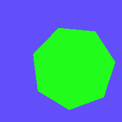
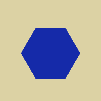
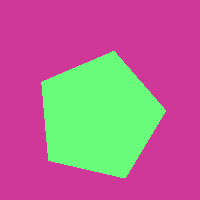
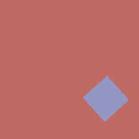

class: inverse-blue, center, middle
# Deep Learning: The Approach of Last Resort


```{r load_refs, echo=FALSE, cache=FALSE, include = F}
library(RefManageR)
BibOptions(check.entries = FALSE, 
           bib.style = "numeric", 
           cite.style = 'authoryear', 
           style = "html",
           hyperlink = FALSE, 
           no.print.fields = c("isbn", "urldate"),
           dashed = FALSE)

bb <- ReadBib("./refs.bib", check = T)
```

```{r setup, include = F}
library(tidyverse)
library(magrittr)
library(ggplot2)
library(keras)
library(furrr)
plan(multicore)
mytheme <- theme_bw() + 
  theme(panel.grid.major = element_line(color = "grey50"),
        panel.grid.minor = element_line(color = "grey60"),
        plot.background = element_rect(fill = "transparent", color = NA),
        legend.background = element_rect(fill = "white", color = "grey"))

theme_set(mytheme)
knitr::opts_chunk$set(dev.args = list(bg = 'transparent'), 
                      echo = FALSE, message = F, warning = F, cache = T, 
                      dpi = 300, dev = 'png')

source("~/models/shoe_nn/Generate_Model_Images.R")
```

```{r model-loading, include = F}
model_path <- "~/models/shoe_nn/TrainedModels/"

# newest_model <- get_newest(dir = model_path, pattern = "weights.h5")
newest_model <- list(
  path = "/home/susan/models/shoe_nn/TrainedModels/20190514-155453",
  base_file = "2019-05-14_15:54:53_vgg16_onehotaug_9class_256-weights.h5",
  start_date = "2019-05-14_15:54:53",
  process_dir = "20190514-155453")

newest_data_file <- file.path("~/models/shoe_nn/RProcessedImages/", newest_model$process_dir, "cropped_photos.Rdata")

load(newest_data_file)

# Load Keras models
library(keras)
model_dir <- newest_model$path
load(list.files(model_dir, "-history.Rdata", full.names = T)[1])
load(file.path(get_newest()$path, get_newest(pattern = "\\d.Rdata")$base_file))
```

```{r labeled-data, include = F}
label_fixes <- c("triangles" = "triangle",
                 "trianglee" = "triangle",
                 "circlemtraignle" = "circle_triangle",
                 "circle triangle" = "circle_triangle",
                 "circleline" = "circle_line",
                 "circle text" = "circle_text",
                 "circle_elongated" = "circle",
                 "cricle|cirle" = "circle",
                 "chrevron" = "chevron",
                 "lie" = "line",
                 "texxt" = "text",
                 "star quad" = "star_quad",
                 "exc_idd" = "exclude",
                 "quad?" = "quad",
                 "qaud|qud" = "quad", 
                 "stars|start" = "star", 
                 "exlude" = "exclude",
                 "rounded" = "",
                 "smooth_texture" = "other",
                 "octagon" = "polygon",
                 "crepe" = "other",
                 "hex" = "polygon",
                 "smooth|hatching" = "other"
                 )
# Merge doesn't work, wtf???
annotated_imgs <- select(dfunion, image, name) %>%
  mutate(base_image = basename(image)) %>%
  mutate(num_labels = str_count(name, "_") + 1, 
         annot_num = 1:n()) %>%
  mutate(labels = str_remove_all(name, "\\(.{1,2}\\)") %>% 
           str_replace_all(label_fixes) %>% 
           str_split("_")) %>%
  unnest(labels) %>%
  mutate(labels = str_replace_all(labels, label_fixes)) %>%
  mutate(label_type = ifelse(num_labels == 1, "single", "multi")) %>%
  filter(labels != "") %>%
  filter(labels != "exclude") %>%
  filter(labels != "ribbon" & labels != "logo") %>%
  filter(labels %in% c(default_classes, "other"))

fix_annotation <- function(annot) {
  useful_vars <- c("name", "deleted", "date", "id", "username")
  new_vars <- set_names(useful_vars, c("name", "deleted", "date", "objID", "username"))
  
  get_vars <- new_vars[new_vars %in% names(annot)]
  
  if (!is.null(annot)) select(annot, !!get_vars) %>% as_tibble() else tibble()
}

authors <- df %>%
  filter(!is.null(fullannot)) %>%
  mutate(base_image = basename(image)) %>%
  select(id, base_image, image, fullannot) %>%
  filter(!is.null(date)) %>%
  mutate(miniannot = map(fullannot, fix_annotation)) %>%
  select(-fullannot) %>%
  unnest(miniannot)
```

<!-- 2:30-4:25 Tuesday, February 8 -->
<!-- https://openprairie.sdstate.edu/datascience_symposium/2022SessionSchedule.pdf -->

<!-- Forensic Statistics -->

<!-- Organizer(s): Christopher Saunders & Alicia Carriquiry -->
<!-- Topological data analysis of dynamic Ethereum token networks, Yuzhou Chen - Princeton University  -->
<!-- Forensic Handwriting Identification using Random Forests and Score-based Likelihood Ratios, Danica Ommen - Iowa State University -->
<!-- How Do You Define a Circle? Perception and Computer Vision Diagnostics, Susan Vanderplas - University of Nebraska Lincoln -->


<!-- Abstract: Neural Networks are very complicated and very useful models for image recognition, but they are generally used to recognize very complex and multifaceted stimuli, like cars or people. When neural networks are used to recognize simpler objects with overlapping feature sets, things can go a bit haywire. In this talk, we'll discuss a model built for applications in statistical forensics which uncovered some very interesting problems between model-based perception and human perception. I will show visual diagnostics which provide insight into the model, and talk about ways we might address the discrepancy between human perception and model perception to produce more accurate and useful model predictions.  -->

???

I mention here that deep learning and neural networks were my approach of last resort because I honestly much prefer models with interpretable parameters. Unfortunately, I have no idea how to fit such a model to image data without a huge amount of feature engineering, and my attempts at doing that kind of feature engineering didn't work out when I first started in on this project. So I'll start out explaining the project, and I think you'll quickly see why I reluctantly turned to neural networks for computer vision based modeling -- it was because there were so few other options that seemed like they might plausibly work.

---
class: primary-blue
## Project Description

.pull-left-40[

].pull-right-60[
- Gather images of shoe soles from the population

- Identify features in the shoe sole patterns that make for a relatively unique description of the pattern

- Use pattern descriptions to characterize the types of shoes worn by a population

    - May be useful to get a random match probability for forensic analysis
    
> .large[Quantifying the frequency of shoes in a local population is an unsolveable problem]<br/> - Leslie Hammer, [Hammer Forensics](https://hammerforensics.com/), March 2018

]


???

The goal of this project, in forensic space, is to develop a method for sampling and assessing which shoes are common in a local population. In order to do much of anything probabilistically with forensic shoe evidence, we need to understand the local population of potential suspects, but gathering that data is not something that has been feasible up until this point. So I'm collaborating with a fantastic engineering team at Iowa State to build a shoe scanner that works something like a camera trap for wildlife - we take pictures of the bottom of people's shoes as they walk by, and take great pains to avoid gathering any information about anything other than the shoes. 

The goal here is to then take the pictures we gather, identify features that describe the shoe tread pattern, and work with a basis of those pattern features to describe the local population. This may eventually help us calculate a random match probability between evidence at a crime scene and the local population.

I would also be remiss if I didn't mention that the whole reason I started in on this project is because someone told me it would be impossible. We'll see if she's right, but I think that while this is a *hard* problem, it's not an unsolvable problem, or at least, won't be unsolvable once our shoe scanner and statistical algorithms get working properly.


---
class:primary-blue
## Relevant Features

Use features other than make/model and size to characterize shoes

- Knockoffs often have very similar tread patterns
- Similar styles have similar tread patterns across brands
- Unknown shoes can still be classified and assessed

| Dr. Martens | Eastland | Timberland |
| --- | --- | --- |
|  |  |  |
| Work 2295 Rigger | 1955 Edition Jett | 6" Premium Boot |

???

Some of you may be wondering why we're working with specific features of the shoe pattern instead of trying to identify the specific shoe models. There are many reasons -- first, there's no database of shoe patterns out there that match to specific shoe models. Different year models actually have different patterns, and some shoe sole patterns are shared across models. In addition, there are tons of knockoffs, and shared patterns across different brands of similar types of shoes. So in my opinion, at least, it's more productive to work with tread features and not worry about identifying specific brand/style/models of shoes. 

---
class:primary-blue
## The Features


<table class="featuretable">
<thead><tr><th style = "width:33%"> Bowtie </th><th style = "width:33%"> Chevron </th><th style = "width:33%"> Circle </th></tr></thead>
<tr><td></td><td></td><td></td></tr>
<tr><th> Line </th><th> Polygon </th><th> Quadrilateral </th></tr>
<tr><td></td><td></td><td></td></tr>
<tr><th> Star </th><th> Text </th><th> Triangle </th></tr>
<tr><td></td><td></td><td></td></tr>
</table>

Used to separate shoes by make/model in (small) local samples `r Citep(bb, 'gross_variability_2013', .opts = list(max.names = 1, longnamesfirst = F))`

???

When we started this project, we decided on a set of 8 features + an "other" category to catch anything that was left out. We based this on a forensics paper that found that with a similar set of features, an entire set of shoe prints gathered from college students could be differentiated into make/model groups. 

---
class:primary-red
## Data Labeling

.center.img75[]

- [LabelMe Annotation Tool](https://github.com/CSAILVision/LabelMeAnnotationTool) `r Citep(bb, 'russell_labelme_2008', .opts = list(max.names = 1, longnamesfirst = F))`

- `r prettyNum(length(unique(annotated_imgs$annot_num)), big.mark =  ",")` regions labeled with one or more geometric objects

- `r prettyNum(length(annotated_imgs$image), big.mark =  ",")` labels

- .small[Labeling courtesy of Jenny Kim, Ben Wonderlin,  Mya Fisher, Holden Jud, Miranda Tilton, Charlotte Roiger, Joe Zemmels, Xinyu Liu, and others.
]

???

The data for this project was labeled using Label Me (and recently we've moved on to other annotation tools). Paid students and volunteers took on the tedious task of labeling features on the shoe sole images while watching Netflix, and generated an impressive amount of data. 


---
class:primary-red
## Data

.center[]

- Shoe scanner *just* became viable at the end of July 2021

- [`ShoeScrapeR` package](https://github.com/srvanderplas/ShoeScrapeR)

<!-- `r system("tree ~/Projects/CSAFE/2020-ShoeScrapeR/extra/bottom/all_photos/ | tail -1", intern = T) %>% str_extract("\\d{1,} files") %>% str_replace("files", "images")`  -->
- 194624 images scraped since April 2018

???

We started out using data scraped from online shoe shopping sites. We will eventually update this model with data from the shoe scanner itself (which will be messier) but when we started this project, we didn't have a working shoe scanner, so we had to make do with other data. I've had a script running 4x a day since April 2018, and while it's definitely not perfect, it has managed to pull down almost 200 thousand shoe images in the last 3 years with relatively minimal updates. 

---
class:primary-red
## Data

.pull-left[
#### Online Shopping Data

- Clearer images

- Huge amounts of data available

- Not representative of a local community

- Not representative of data quality from the scanner
].pull-right[
#### Shoe Scanner data

- Tread worn down, mud/dirt, glare from the scanner, outdoor lighting conditions

- Less data available     
$<300$ im/wk over the summer

- Representative of the local community

- **Plan**: Use to update a model trained on online shopping data by tuning the model weights
]

???

When we started the project, we only had the online shopping images; now we're close to having Shoe scanner images as well. So the plan is to train a model on the online shopping data, and then tweak/update the model weights to account for reduced data quality with the shoe scanner data once we get enough data out of the scanner to label and fit a model. It won't be easy but it should be feasible once we get a working model.

---
class:primary-blue
## Deep Learning

### My assumption
> If deep learning is able to accurately identify cars, planes, bicycles, and traffic lights in images, it should be able to differentiate circles from rectangles


### The Plan

- Use VGG16 (a Convolutional Neural Network model) as the basis of the model `r Citep(bb, 'simonyan_very_2014', .opts = list(max.names = 1, longnamesfirst = F))`

    - Train a new classifier focused on 9 types of shapes found in shoe soles (transfer learning)
    
    - Feed in data labeled by undergraduates
    
    - Voila! A working shoe tread feature identification model!
    
???

Obviously, deep learning has produced some really cool results in the past few years. If deep learning models can identify people in pictures, label dog breeds, distinguish different types of elephants, planes, cars, and such, then they should be able to recognize the simpler features we have decided to use to classify shoes, right?

We should just be able to train a new model head (using transfer learning) and that will output probabilities that can be used to determine which features are in a given image. I'm glossing over how the VGG16 model works because this presentation is only 20 minutes long, and because it's a relatively simple deep learning model that would take at least 20 minutes to explain -- and it's been largely superseded by more complicated models at this point. 

We figured if we had enough labeled data, that this approach would work relatively well -- and for the most part it did! But it's also important to note that this project had some pretty specific requirements -- we have a target audience and really need to make things work with our audience. 

---
class:primary-blue
## Justifying the plan

- Past studies have used the output from the convolutional network (without a trained model head)

    - these features aren't easy to explain to practitioners (or understand)
    
    - for any models like this to be accepted in forensics, they need to be explainable!


<br/><br/>
.center[]

???

Specifically, when we're done with this whole project -- the scanner and the model -- we have to convince forensic examiners that it's worth using. And forensic examiners are a great bunch of people - for the most part, they're very dedicated, very smart, and have a lot of expertise in their field. But their field is definitively not math, and most of them are not what we'd call quantitatively oriented. So that is a big limitation on what we can do with neural networks. 

A lot of previous work with neural networks in forensic pattern analysis uses features directly from the model base, without a trained model head. These features don't make sense to practitioners, so the entire research project is dead before it starts, because we have to get examiners to adopt this stuff before it makes any practical impact. 

We want to avoid this process, so we specifically set up this model to spit out features that we can all describe -- lines, circles, bowties, chevrons. We have to work within the confines of human language and our model has to spit out features that are explainable to examiners and can be generated by examiners.

I didn't expect this to be a huge issue, given that these networks could successfully distinguish African and Asian elephants, or specific car models (both tasks that I'm really not that great at myself). So it seems reasonable that it should be able to identify what's a square and what's a circle, right?


---
class:primary-red
## Label Data
```{r label-data-barchart, fig.width = 6, fig.height = 4, out.width = "90%", dpi = 300, fig.cap = "Distribution of classes in all labeled images. Quadrilaterals, lines, circles, text, and chevrons are relatively common; stars, polygons, and bowties are relatively uncommon."}
annotated_imgs %>%
  mutate(label_type = str_replace(label_type, "multi", "multiple")) %>%
  mutate(labels = str_to_title(labels)) %>%
  mutate(labels = factor(labels, levels = c("Quad", "Line", "Text", "Circle", "Chevron", "Triangle", "Polygon", "Star", "Bowtie", "Other"))) %>%
  ggplot() + 
  geom_bar(aes(x = labels, fill = label_type), color = "black") + 
  scale_fill_manual("Labels", values = c("single" = "#6ba2b9", "multiple" = "#2e5597")) + 
  coord_flip() + 
  ylab("# Labeled Images") + 
  xlab("")  + 
  ggtitle("Current Class Distribution (All Labeled Images)") + 
  mytheme + 
  theme(legend.position = c(1, 1), legend.justification = c(1.03, 1.03), legend.background = element_rect(fill = "white"))
```

???

This graph reflects the current state of class labels. There are far more quadrilaterals, lines, and text than any other category; quads in particular are more likely to appear alone than in multiple groups. Stars, polygons, and bowties are much less likely to occur; this large discrepancy in class frequency does make modeling more interesting, but again, class imbalances aren't anything new in machine learning or statistics. 

---
class:primary-red
## Model Specification
Multiple classes, multiple labels: "One-hot" encoding

Statistically: 

- Model output:  $(P_1, ..., P_9) \in [0,1]^9$
    - Each geometric feature assigned a probability
    - An image can be labeled with multiple features

- Output probabilities $P_i$ are not independent
    - Dependencies due to CNN structure
    - Dependencies due to input data
    - Dependencies due to geometric similarity -     
    Polygons vs. Quadrilaterals
    
- Covariance structure is ?

???

We talked previously about the model structure in a generic sense; now let's talk about the specifics. We're going to be using what's called "one hot" encoding, that is, indicator variables, and we're going to allow our model to output a separate probability for each of the 9 labeled classes; these probabilities won't sum to one, but they're not independent either. The dependency structure is complicated - output probabilities depend on the model structure, but there are also dependencies based on the geometric similarity - a quadrilateral is likely more similar to a polygon than to a line.  We don't have any real way to describe the complicated dependency structure - this is one of the downsides to using a model that's this complicated. The upside is that the model is actually capable of doing what we're asking of it; less complicated models didn't really succeed at that. 


---
class:primary-red
## Model Training

- 256 x 256 pixel images

- Training data (60-70%):
    - 1x Augmented images (rotation, skew, zoom, crop) to prevent overfitting
    - Class weights used to counteract uneven class sizes
    
- Validation and test data (15-20% each)

- Fit using the `keras` package in R, which provides a high-level API for the `tensorflow` library <br/>
`r Citep(bb, c('chollet_deep_2018', 'tensorflow2015-whitepaper', .opts = list(max.names = 1, longnamesfirst = F)))`

.bottom[
 
 
 
 
 
 
 

]

???

We scaled all of the labeled images to 256 x 256; aspect ratio was not preserved, though some steps have been taken to ensure that the labeled regions are at least square-ish where possible to prevent extreme distortion. 

60% of the labeled images were used as training data; these images were augmented once by zooming, skewing, cropping, and rotating the images. This step is recommended to prevent over-fitting. Examples of original and augmented images are shown on the right side of the slide.

Validation data, which is used within each fitting iteration to calculate the loss function, accounted for 20% of the images, and test data, which is used to evaluate the model at the end of the fitting process, accounted for the remaining 20%. 

We used the keras package in R to fit the model using the tensorflow toolkit. Tensorflow is an extremely efficient implementation that can use either the CPU or GPU to fit the neural network. It was originally developed by Google's Machine Intelligence team. Keras makes it easy to use VGG16, remove the model head, freeze the weights on the base, and add a new head, using only a few lines of code. 

---
class:primary-red
## Model Training

```{r training-accuracy, fig.width = 7.5, fig.height = 5, fig.align="center", out.width = "90%", fig.cap = "Training and Validation accuracy and loss for each epoch of the fitting process. Training and validation accuracy reach 90% around epoch 14. After that point, validation loss remains about the same and training loss decreases slightly, while validation accuracy increases more slowly than training accuracy."}
data.frame(history$metrics) %>%
  mutate(epoch = 1:n()) %>%
  gather(key = "measure", value = "value", -epoch) %>%
  mutate(Type = ifelse(str_detect(measure, "val"), "Validation", "Training"),
         measure = ifelse(str_detect(measure, "acc"), "Accuracy", "Loss")) %>%
  # bind_rows(tibble(epoch = NA, value =  .6, measure = "Accuracy", Type = "Validation")) %>%
  # bind_rows(tibble(epoch = NA, value =  .33, measure = "Loss", Type = "Validation")) %>%
  ggplot(aes(x = epoch, y = value, color = Type)) + 
  scale_color_manual(values = c("#40b4e5", "#cf0a2c")) + 
  geom_point() + 
  geom_smooth(se = F) + 
  facet_grid(measure~., scales = "free_y", switch = "both") + 
  theme_bw() + 
  scale_y_continuous("") + 
  scale_x_continuous("Epoch") + 
  ggtitle("CoNNOR Training Performance") + mytheme + 
  theme(axis.title.y = element_blank(), legend.position = c(1, .5), legend.justification = c(1.03, -0.05), legend.background = element_rect(fill = "transparent", color = "grey"))
```

.bottom[Binary Cross-entropy Loss: 
$-y\log(p)-(1-y)\log(1-p)$
]

???

This chart shows model performance relative to the loss and accuracy rate during each epoch (backpropagation occurs after each epoch of fitting). The loss function used to fit the model is the cross-entropy function. 

Validation loss levels off after 15 epochs, but hasn't yet begun to increase. Training loss is still decreasing as well. One concern with retraining the head of a CNN is that with relatively little data (e.g. 20 thousand data points instead of 150K) it is easy to over-fit models; what we see is that this hasn't yet happened for this model. Overfitting would be evident if the loss in the training set had beun to increase. 


---
class: inverse-green, center, middle
# Assessing the Model

---
class:primary-green
## Evaluating the Model
```{r overall-roc, out.width = "100%", fig.width = 7, fig.height = 4.375}
library(pROC)
pred_df <- as_tibble(preds) %>% gather(key = feature, value = value)
test_labs_df <- as_tibble(test_labs) %>% gather(key = feature, value = value)
whole_model_roc <- roc(test_labs_df$value, pred_df$value)

whole_model_roc_df <- tibble(tpr = whole_model_roc$sensitivities, 
                             fpr = 1 - whole_model_roc$specificities,
                             thresholds = whole_model_roc$thresholds,
                             auc = whole_model_roc$auc[1]) %>%
  nest(tpr, fpr, thresholds, .key =  "roc_plot") %>%
  mutate(eer = purrr::map(roc_plot, eer))
ggplot() + 
  geom_line(aes(x = fpr, y = tpr), data = unnest(whole_model_roc_df, roc_plot), size = 1.25) + 
  geom_label(aes(x = 1, y = 0, label = sprintf("AUC: %0.2f", auc)), hjust = 1, vjust = -0.2, data = whole_model_roc_df) +
  geom_point(aes(x = fpr, y = tpr, color = "Equal Error Rate"), data = unnest(whole_model_roc_df, eer), size = 2) +
  scale_color_manual("", values = "black") +
  scale_x_continuous("False Positive Rate", breaks = c(0, .25, .5, .75, 1), labels = c("0.0", "", "0.5", "", "1.0")) +
  scale_y_continuous("True Positive Rate", breaks = c(0, .25, .5, .75, 1), labels = c("0.0", "", "0.5", "", "1.0")) + 
  ggtitle("CoNNOR Test Set Performance (All Classes)") + 
  coord_fixed() + mytheme + 
  theme(legend.position = "bottom", legend.title = element_blank(), legend.background = element_rect(fill = "transparent", color = NA)) 

```

???

We can compute an aggregate ROC curve that treats all classes the same. Under this, we see that performance is generally fairly good, though there is obviously room for improvement. The more interesting evaluation is to look at prediction accuracy for each label...

---
class:primary-green
## Evaluating the Model
<!-- Add in model overall AUC -->
<!-- Describe the multi-class version as splitting out model performance by class --> 
```{r roc-setup, eval = F}
aucs <- plot_onehot_roc(preds, test_labs, str_to_title(classes))
thresholds <- purrr::map_dbl(aucs$data$eer, ~.$thresholds)
aucs$data$thresholds <- thresholds
aucs1 <- unnest(select(aucs$data, -thresholds), roc_plot) %>% 
  select(-eer, -rocs)
aucs2 <- unnest(select(aucs$data, -thresholds), eer) %>%
  select(-roc_plot, -rocs)
aucs3 <- aucs$data %>% select(-rocs, -roc_plot, -eer)
save(thresholds, aucs1, aucs2, aucs3, file = "aucs.Rdata")
```

```{r class-roc, fig.width = 7.5, fig.height = 5, out.width = "99%", fig.cap = "Receiver Operating Characteristic curves for the 9 classes used to fit CoNNOR, generated individually for each class.", cache = T}
load("aucs.Rdata")

ggplot() +
  geom_line(aes(x = fpr, y = tpr), data = aucs1, size = 1.25) +
  geom_label(aes(x = 1, y = 0, label = sprintf("AUC: %0.2f\nEER: %0.2f", auc, thresholds)), hjust = 1, vjust = -0.02, data = aucs3) +
  geom_point(aes(x = fpr, y = tpr, color = "Equal Error\nRate (EER)"), data = aucs2, size = 2.5) +
  scale_color_manual("", values = "black") +
  facet_wrap(~class) +
  scale_x_continuous("False Positive Rate", breaks = c(0, .25, .5, .75, 1), labels = c("0.0", "", "0.5", "", "1.0")) +
  scale_y_continuous("True Positive Rate", breaks = c(0, .25, .5, .75, 1), labels = c("0.0", "", "0.5", "", "1.0")) +
  ggtitle("CoNNOR Test Set Performance") + 
  facet_wrap(~class, nrow = 2) + 
  coord_fixed() + mytheme + 
  theme(legend.position = c(1, 0), legend.justification = c(1, 0), legend.title = element_blank(), plot.background = element_rect(fill = "transparent"), legend.background = element_rect(fill = "transparent", color = NA))
```

???

These plots show ROC curves for each class, computed separately. Equal error rates are marked with a dot, and show the point at which it is equally likely for the model to miss a classification or wrongly classify an image. These EERs are used as an optimized cutoff value for diagnostics which require a hard threshold, like a confusion matrix. Most cutoff rates are around .1, though for classes with less data, such as stars and polygons, the cutoff rate is typically smaller. 

---
class:primary-green
## Evaluating the Model
.pull-left-80[
```{r ConfMatrix, message = F, warning = F, fig.width = 7.5, fig.height = 6.5, out.width = "100%", fig.align='center', fig.cap = "Multi-class confusion matrix for CoNNOR. When an image has multiple labels, it is considered separately for each label; additional labels associated with the image are excluded from the calculation of incorrect predictions. The equal-error rate for each class (computed from the ROC curve on the previous slide) is used as a cutoff threshold (e.g. different classes have different thresholds. Most classes achieve greater than 75% prediction accuracy. The model predicts quadrilaterals with higher frequency than supported by the data for all classes."}


get_confusion_matrix(preds, test_labs, str_to_title(classes), threshold = thresholds) %>%
  set_names(str_to_title(classes)) %>%
  ggcorrplot(., hc.order = F, outline.col = "white", lab = T) +
  scale_fill_gradient("Classification\nRate", low = "white", high = "#00833e", limits = c(0, 1)) +
  scale_x_discrete("Image Label") + scale_y_discrete("Prediction") +
  theme(axis.title.x = element_text(size = 14), axis.title.y = element_text(size = 14, angle = 90, vjust = 1)) +
  ggtitle("CoNNOR Multi-Class Confusion Matrix: Test Set Performance") + 
  mytheme +
  theme(legend.background = element_rect(fill = "transparent", color = NA), 
        plot.margin = grid::unit(c(0,0,0,0), "mm"), plot.background = element_rect(fill = "transparent", color = NA),
        plot.subtitle = element_blank(), plot.caption = element_blank(), panel.spacing = unit(c(0, 0, 0, 0), "mm"))
```
]
.pull-right-20[
For multi-label images, only incorrect predictions contribute to off-diagonal probabilities. 

$EER_i$ used as the cutoff
]

???

This confusion matrix shows, for each label, the probability that the image is classified as that label as well as other possible labels. One modification we made to the standard confusion matrix was to exclude any additional "correct" labels from these calculations: If an image was labeled with a circle and a line, but the model assigned circle and triangle as labels, then in the circle column that image would register as a true positive for circle and a false positive for triangle; line would be excluded from calculations in that column.

An important point to make at this juncture is that while we're operating as if our labeled data were "ground truth", that isn't an accurate assumption. People make mistakes, labeling is monotonous, and the criteria for certain classes have changed over time. In some cases, the model is correct, and the labels are wrong. We're working on correcting the labeling, but even in a situation where the labeling is done in accordance with the guidelines, some of the criteria can get fuzzy in practice. 


---
class:primary-green
## Definitions matter
.pull-left-80[


]
.pull-right-20[<br/><br/>Blue: Prediction matches image label <br/><br/>Grey: Prediction does not match image label]

???

We created a shiny application to see the images and the model's predictions. Blue means that the image had that label, grey means it does not. I've selected two images that show both correct and incorrect model classifications. 

In the first image, the design is labeled as a quadrilateral and the model identifies that, but also identifies image as containing a circle very strongly. When we look at the image, the confusion is understandable. One half of the shape is angular, the other is rounded, so the shape has features of both a quadrilateral and a circle. We've decided to label these images as both (owing to the ambiguity), but that means we have to correct all of the previously labeled images. We're working on that. 

In the second image, the model predicts circles, quadrilaterals, and text, but the image is labeled as having quadrilaterals and text. The circles happen to be part of the text (and the letters aren't even Os), and our brains pick up on the text but ignore the circles because we perceive things holistically; the model does not. We're also in the process of updating these labels, because again, the data is not correct; the model absolutely is. 

We're trying to ensure that the data used to train the model is of very high quality, while not spending millions of dollars to hire workers online to label things. Because we determined the guidelines for labeling the data, labeled the data (or oversaw the labeling), and trained the model ourselves, we have the advantage of knowing the flaws at every point in the process; that means we have the responsibility to fix those flaws where possible. 

We're not doing inference on the model results at this point (nor planning to use the data we're training the model with during the operational stage) so the data -> model -> fix data loop is less of a validity concern. 

When the model is sufficiently well-calibrated, we can then work with engineers to build the device, collect some initial data, and tweak the model weights with new data that better represents what we'll actually see from the collection equipment. By that point, hopefully we'll also have narrowed down the geometric classification scheme so that categories that are now somewhat fuzzy are more clearly operationalized.


---
class:primary-green
## Interpreting the model<br>Class Activation Maps
.pull-left-80[
<br/>
<br/>

<br/>
<br/>
Heatmaps are scaled by class. Yellow = high activation
].pull-right-20[<br/><br/>Blue: Prediction matches image label <br/><br/>Grey: Prediction does not match image label]

???

These maps, called class activation maps, show the areas of the image which most contribute to each label. Here, I've picked 3 labels to show you, 2 that are relevant, one that is not. You can see that the D shape in this image is producing labels of both circle and quadrilateral, and that the relevant parts of the D contribute to each label - the sharp corners are what the model uses when it's predicting a quadrilateral, and the rounded edges contribute to the circle. 

Class activation maps are a really cool diagnostic for this type of model, because we can see exactly what the model is "thinking" about the data. 

---
class:primary-green
## Interpreting the model<br>Class Activation Maps
.pull-left-80[
<br/>
<br/>

<br/>
<br/>
Heatmaps are scaled by class. Yellow = high activation
]
.pull-right-20[<br/><br/>Blue: Prediction matches image label <br/><br/>Grey: Prediction does not match image label]

???

Let's look at a couple of other class activation maps for images that produced interesting conclusions. 

Here's an image similar to the one I showed you earlier, with Adidas text; the heatmap is easier to see using a slightly different color. You can see that the top and bottom of the "d" are most important in determining text, but that the model is clearly cuing in to the circles inside of the a and d. It's doing exactly what we asked it to do - it just might not have been what we meant originally. 

Interestingly, here is an issue with how we label images -- should we be labeling these text images as circles as well? It's an open question -- obviously the model prediction isn't wrong, but ... neither is the human-assigned label. We're just capable of recognizing that text as a class may supersede circles, and the model is ... not.

Labeling things is hard, evidently. Much harder than I originally thought it would be.

---
class:primary-green
## Interpreting the model<br>Class Activation Maps
.pull-left-80[
<br/>
<br/>

<br/>
<br/>
Heatmaps are scaled by class. Yellow = high activation
]
.pull-right-20[<br/><br/>Blue: Prediction matches image label <br/><br/>Grey: Prediction does not match image label]

???

Here's an example of an image where the model is strongly suggesting there are circles, but where we would not agree. It's not hard to see why the model thinks circles would be here, but if it isn't a closed loop, I can't in good conscience suggest it's a circle. Just because the model says something with confidence doesn't mean we change the labels on the original image. It's a screening tool, but we don't want to inflate the model's accuracy at the expense of the actual accuracy.


---
class:primary-green
## So what went wrong?

A few options:

- Data labeling is wrong and should be adjusted

- Shoe patterns are too complicated to be summarized and labeled with simple geometric shapes -- there is too much other context needed

- There is a difference between recognizing simple shapes and recognizing objects in complex organic images. 
    - We used the wrong model base
    - We're asking too much in general - models can't handle human labeling nuances
    


???

After looking at the class activation map diagnostics, it's pretty clear that there are a few things "wrong" with our original model. For one thing, we can certainly say that our data isn't labeled optimally - human labelers missed things. Our labeling scheme as a whole has class overlaps between e.g. circles and text. And we weren't great at specifying how to handle e.g. rounded corners on a square, or how to distinguish when something is a square and when it is a circle. That turns out to be a pretty interesting problem, really.

It's possible that shoe patterns are too complicated to be labeled with simple geometric shapes, but examiners have been doing just that for 50 years. So the real issue is figuring out how to get human levels of nuance into a deep learning model.

Finally, it's possible that the models we're using just aren't the right model. Maybe VGG16 isn't capable of the global context that some other model like ResNet or YOLO would be capable of. 
It's important to note that this isn't a total failure - in the end, we can use the predictions from the labels as features even if they're not 100% accurate. But, it would be nice to have a model that didn't fail in weird ways with inputs that occur fairly frequently - it's not like Adidas or DC shoes are uncommon.

So after puzzling over this model for the better part of 2 years, I recently found a python script that would generate shapes for me, allowing me to do a little more investigation into how the model handles geometric shapes.

---
class:primary-green
## "Shape" model

- Fit a model to simple shapes (3-9 sided regular polygons, circles, stars)
    - Data generated using `elkorchi/2DGeometricShapesGenerator`'s github repo + scripts
    
    - Major differences in data:
        - only one shape per image
        - no rounded corners
        - not photographs, relatively high contrast
        - everything labeled properly

- Determine where the model succeeds and fails
    - Test on ambiguous shapes (spirals, squircles)
    - Adapt the data generation script to be more realistic
    - Refit
    








???

Fundamentally, what I wanted to do was to fit a model to simple shapes and see how the same model fitting process would work. This will help distinguish between "VGG16 can't handle this" and "we have a data quality issue". There are some major differences in the data at this point -- for one thing, each image has only one class, but also, we don't have rounded corners, images are synthetic and high contrast, and there are no labeling issues at all because we're specifically generating shapes that fall into each particular class. 

But, with this, we can also test on ambiguous shapes and see what happens.

Now, this is relatively recent work, and my Python coding skills aren't up to date, so I'm going to show you to the tip of the iceberg here, and hopefully soon I'll get back up on my Python skills enough to change the script and e.g. add multiple shapes to the image, or allow rounded corners. Then this little side project will be even more useful. But fundamentally, I used the same script to fit this model as the shoe model, so any interesting things should carry over between the two models. 
    
```{r model-loading2, include = F, cache = F}
model_path <- "~/Projects/CSAFE/2021-Shapes-Exploration/"

# newest_model <- get_newest(dir = model_path, pattern = "weights.h5")
newest_model <- list(path = "/home/susan/Projects/CSAFE/2021-Shapes-Exploration/shape-model-data/2021-08-04_12:03:07",
                     base_file = "2021-08-04_12:03:07_vgg16_onehotaug_9class_256-weights.h5",
                     prefix = "vgg16_onehotaug_9class_256",
                     start_date = "2021-08-04_12:03:07",
                     process_dir = "2021-08-04_12:03:07")

newest_data_file <- file.path(model_path, "shape-model-data/",newest_model$process_dir, paste0(str_remove_all(newest_model$process_dir, "//"), "_", newest_model$prefix, "_data.Rdata"))

load(newest_data_file)

# Load Keras models
model_dir <- newest_model$path
load(list.files(model_dir, "-history.Rdata", full.names = T)[1])
load(file.path(newest_model$path, list.files(newest_model$path, "\\d.Rdata")))
```

---
class:primary-green
## Evaluating the Shape Model
<!-- Add in model overall AUC -->
<!-- Describe the multi-class version as splitting out model performance by class --> 
```{r roc-setup2, eval = F}
aucs <- plot_onehot_roc(preds, test_labs, str_to_title(classes))
thresholds <- purrr::map_dbl(aucs$data$eer, ~.$thresholds)
aucs$data$thresholds <- thresholds
aucs1 <- unnest(select(aucs$data, -thresholds), roc_plot) %>% 
  select(-eer, -rocs)
aucs2 <- unnest(select(aucs$data, -thresholds), eer) %>%
  select(-roc_plot, -rocs)
aucs3 <- aucs$data %>% select(-rocs, -roc_plot, -eer)
save(thresholds, aucs1, aucs2, aucs3, file = "aucs2.Rdata")
```

```{r class-roc2, fig.width = 7.5, fig.height = 5, out.width = "99%", fig.cap = "Receiver Operating Characteristic curves for the 9 classes used to fit the shapes model, generated individually for each class.", cache = T}
load("aucs2.Rdata")

aucs1$class <- factor(aucs1$class, levels = c("Star", "Triangle", "Square", "Pentagon", "Hexagon", "Heptagon", "Octagon", "Nonagon", "Circle"))
aucs2$class <- factor(aucs2$class, levels = c("Star", "Triangle", "Square", "Pentagon", "Hexagon", "Heptagon", "Octagon", "Nonagon", "Circle"))
aucs3$class <- factor(aucs3$class, levels = c("Star", "Triangle", "Square", "Pentagon", "Hexagon", "Heptagon", "Octagon", "Nonagon", "Circle"))

ggplot() +
  geom_line(aes(x = fpr, y = tpr), data = aucs1, size = 1.25) +
  geom_label(aes(x = 1, y = 0, label = sprintf("AUC: %0.2f\nEER: %0.2f", auc, thresholds)), hjust = 1, vjust = -0.02, data = aucs3) +
  geom_point(aes(x = fpr, y = tpr, color = "Equal Error\nRate (EER)"), data = aucs2, size = 2.5) +
  scale_color_manual("", values = "black") +
  facet_wrap(~class) +
  scale_x_continuous("False Positive Rate", breaks = c(0, .25, .5, .75, 1), labels = c("0.0", "", "0.5", "", "1.0")) +
  scale_y_continuous("True Positive Rate", breaks = c(0, .25, .5, .75, 1), labels = c("0.0", "", "0.5", "", "1.0")) +
  ggtitle("Shapes Model Test Set Performance") + 
  facet_wrap(~class, nrow = 2) + 
  coord_fixed() + mytheme + 
  theme(legend.position = c(1, 0), legend.justification = c(1, 0), legend.title = element_blank(), plot.background = element_rect(fill = "transparent"), legend.background = element_rect(fill = "transparent", color = NA))
```

???

When we look at how the model is working with the 9 classes generated by the original python script, what I'm seeing is that the model does extremely well for stars, triangles, squares, and even pentagons, but performance quickly starts to degrade a bit for higher n-agons. Still, the model works much better for basic shapes than it does for real-world shoe images (which isn't surprising given the e.g. lack of rounded corners, and lack of real-world imagery). 

---
class:primary-green
## Evaluating the Shape Model
```{r ConfMatrix2, message = F, warning = F, fig.width = 7.5, fig.height = 6.5, out.width = "70%", fig.align='center', fig.cap = "Multi-class confusion matrix for the shape model."}


get_confusion_matrix(preds, test_labs, str_to_title(classes), threshold = thresholds) %>%
  set_names(str_to_title(classes)) %>%
  ggcorrplot(., hc.order = F, outline.col = "white", lab = T) +
  scale_fill_gradient("Classification\nRate", low = "white", high = "#00833e", limits = c(0, 1)) +
  scale_x_discrete("Image Label") + scale_y_discrete("Prediction") +
  theme(axis.title.x = element_text(size = 14), axis.title.y = element_text(size = 14, angle = 90, vjust = 1)) +
  ggtitle("Shape Model Confusion Matrix: Test Set Performance") + 
  mytheme +
  theme(legend.background = element_rect(fill = "transparent", color = NA), 
        plot.margin = grid::unit(c(0,0,0,0), "mm"), plot.background = element_rect(fill = "transparent", color = NA),
        plot.subtitle = element_blank(), plot.caption = element_blank(), panel.spacing = unit(c(0, 0, 0, 0), "mm"))
```

???

If we look at the confusion matrix, we see that this model based on VGG16 isn't great at distinguishing sides/angles. So there's a lot of cross-class confusion between n and n+1 gons, and even between nonagons and circles.

---
class:primary-green
## Evaluating the Shape Model

Image | Circ| Tri* | Square | Penta* | Hexa* | Hepta* | Octa* | Nona* | Star
--- | --- |  --- |  --- |  --- |  --- |  --- |  --- |  --- 
 | .9998986 | 0 | 0 | 0 | 0 | 0 | 0 | 0 | 0
 | .9999964 | 0 | 0 | 0 | 0 | 0 | 0 | 0 | 0

???

Just for fun, I created a couple of images in the style of the images used to fit this model, but that represented things we noticed as problematic in the shoe model. 

One thing that sticks out to me is that the squircle doesn't show up as a square with any significant probability. I suspect that this is because our squares in the training data don't have rounded corners, which is of course easier to achieve with generated data than with things that are actually cast from rubber. I'm not great with python, so I'm going to have to actually go in and add a bit of corner rounding to address this issue and see what's going on -- whether it's a problem where the shoe data is poorly labeled, or whether it's strictly due to the roundness or sharpness of the corners. 

So what I really need to do to further investigate this model is to add rounded corners and multi-class images to the training data and then examine whether I can fit a CNN to synthetic data with acceptable performance. If I can, then the answer is to come up with better labels, more precise labels, and possibly to only train on unambiguous images. 

But, as we discovered with the polygon experiment, there are also some things that CNNs will just inherently have trouble with, and so I also need to design my class labels to not only be human-friendly, but also to be CNN-friendly. 


---
class:inverse-cyan,middle,center
# Conclusion and Questions

???

So I've meandered through this research project in a way that I hope makes sense, but it might be good to take a moment to recap.

---
class:primary-cyan
## Conclusions

- Class activation maps are really helpful for diagnosing problematic deep learning models

- It's also useful to step away from real-world data and see what deep learning models do with synthetic data 

- Labeling things is HARD!

    - Labeling things to be friendly to both computers and humans is... extremely hard.


.center[]

???

As I promised to talk about computer vision diagnostics, I'd just like to say that class activation maps are perhaps my favorite diagnostic for these types of models. They really help you see what the model is "seeing" and reason about how to fix any problems that pop up.

But, the other thing is that with deep learning models that are largely black boxes, traditional debugging techniques like using synthetic data are exceptionally valuable as well - they can help you figure out the limits of your modeling approach, in the same way that simulating fitting a GLM with data that violates assumptions can really help you figure out how much trouble you're in with traditional statistical models.

My final conclusion is that labeling things is a lot harder than I ever anticipated, and doing so in a way that satisfies both humans and computers is *really* hard. But where's the fun in research if you don't take on some of these problems?


---
class:primary-cyan
## Questions

- Email me at susan.vanderplas@unl.edu

- Message me on Twitter (@srvanderplas)
